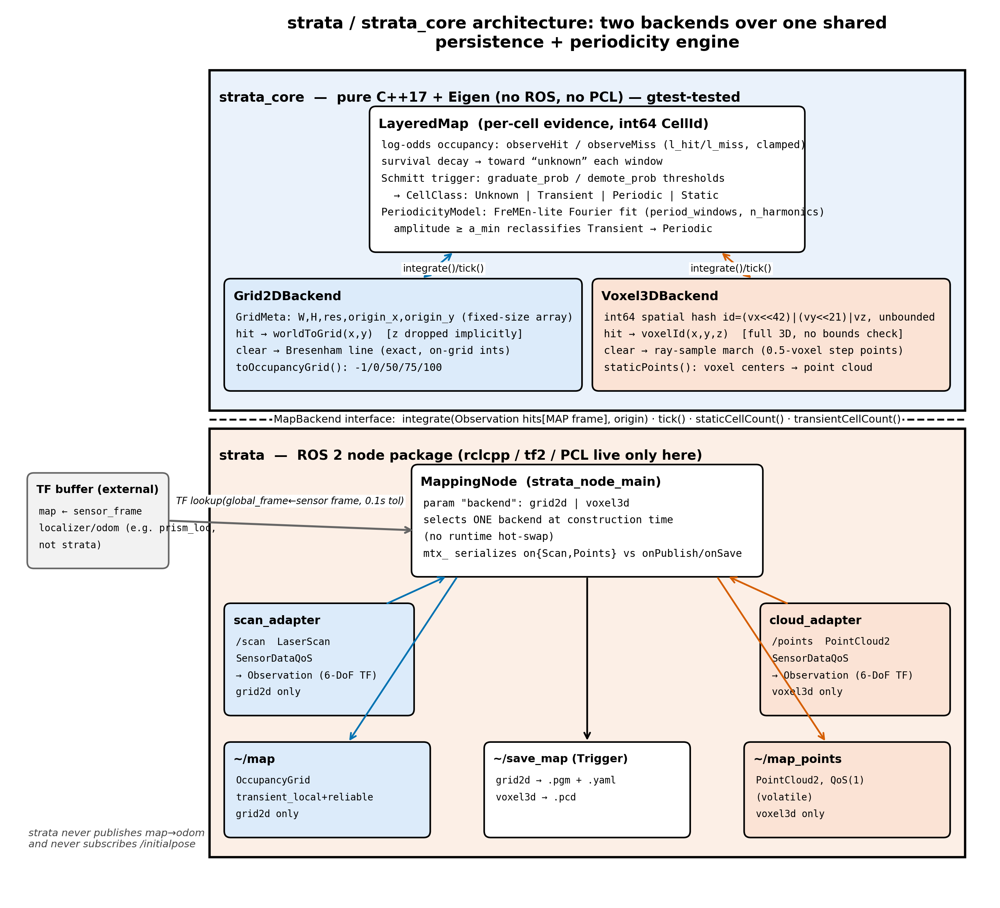
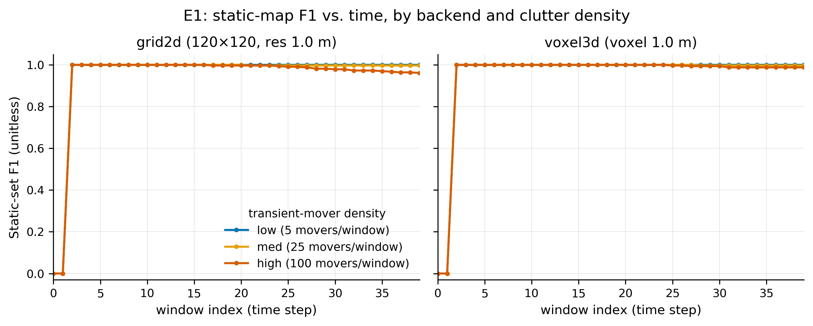
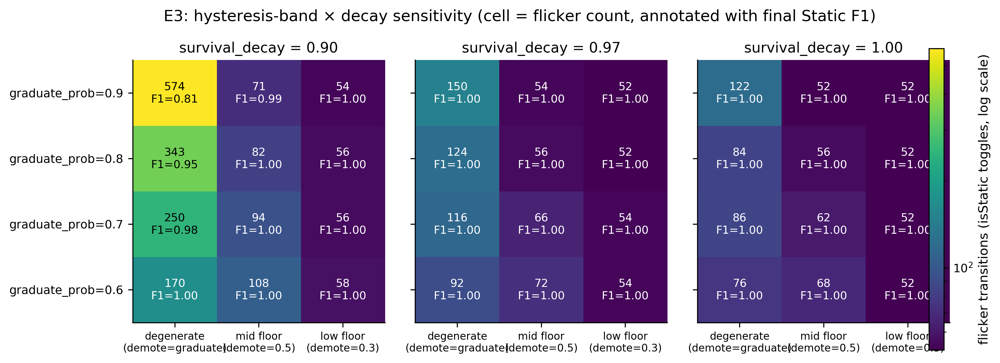

<div align="center">

# STRATA

**One geometry-free persistence-and-periodicity engine, two pluggable LiDAR
backends (2D occupancy grid or 3D voxel), for lifelong mapping in ROS 2 Humble —
pick a backend with one parameter and get a durable static map plus periodic and
transient layers, at full 6-DoF.**

[](https://github.com/kjungmo/strata/actions/workflows/ci.yml)
[](LICENSE)

[](paper/latex/main.pdf)
[](https://github.com/sponsors/kjungmo)

[Overview](#overview) · [Paper](#-paper) · [Install](#-prerequisites) ·
[Quick start](#-quick-start) · [Evaluation](#-evaluation) · [Docs](#-documentation) · [Roadmap](#-roadmap)



</div>

`strata` incrementally builds and maintains a robot map from EITHER a **2D
LiDAR** (`LaserScan` → `OccupancyGrid`) OR a **3D LiDAR** (`PointCloud2` → voxel
cloud), backend chosen by one parameter. A single Bayesian-persistence engine
copes with dynamic AND semi-static environments: it **graduates** durably
occupied cells into a permanent static map, flags **periodically** occupied
cells (FreMEn) instead of baking them in, and lets **transient** observations
fade. Sensor poses are full 6-DoF.

> **`strata` is not a SLAM system.** It does not estimate the robot's pose. It
> consumes an external pose source via TF (`map → sensor`) — e.g. the sibling
> [`prism_loc`](https://github.com/kjungmo/prism_loc) localizer or a plain
> `odom → base_link` chain — and maps against it. Drift in that pose source
> corrupts the map; there is no correction here.

## 📢 News
- **2026-07** — **v0.1.0 public release**: the `strata_core` engine + both
  backends, the paper (EN/KR + typeset PDF), and the seeded E1–E4 reproduction
  harness are all public.

## Overview

One `LayeredMap` persistence core (log-odds occupancy + survival decay +
Schmitt-trigger graduation) and one `PeriodicityModel` (FreMEn-lite) drive
**both** backends behind a `MapBackend` interface — the classifier that
graduates, demotes, prunes, and periodicity-labels every cell is shared by
composition, not duplicated per dimension. The two backends are the two sensor
paths a ground robot actually has:

| | **grid2d** | **voxel3d** |
|---|---|---|
| Input topic / msg | `/scan` (`sensor_msgs/LaserScan`) | `/points` (`sensor_msgs/PointCloud2`) |
| Map output | `nav_msgs/OccupancyGrid` | `PointCloud2` / PCD |
| Geometry & projection | 2D occupancy grid; 6-DoF endpoints projected onto the plane (z dropped) | fully volumetric voxel-hash (x, y, z kept) |
| Ray clearing | Bresenham ray-trace | ray-sample along the beam |

**Why "STRATA".** Like geological **strata**, the map is built from layers of
observation that accumulate over time. Durable layers — seen again and again —
consolidate into the permanent **static** map; **periodic** layers (a door open
by day, shut by night) are recognized as recurring rather than baked in; and
**transient** layers erode away.

**Design principle.** The map engine is pure C++17 + Eigen, keyed by an integer
cell id, and is unit-tested with gtest **without ROS or PCL** (56 gtests across 9
suites, plus 19 node tests). rclcpp, tf2, and PCL live only in the ROS node
package. Because persistence, hysteresis, and periodicity are implemented once,
the behavior is identical across the 2D and 3D backends.

<details>
<summary>Text architecture diagram (the hero figure above, as ASCII)</summary>

```
strata_core   (pure C++17 + Eigen, no ROS / no PCL, gtest-tested):

  LayeredMap  ── THE HEART ──────────────────────────────────────────
    log-odds occupancy (l_hit/l_miss + clamp)
    survival decay  (Persistence Filter forgetting toward unknown)
    Schmitt trigger graduate(graduate_prob) / demote(demote_prob)   ─► Static
        │                                                              │
        └─► PeriodicityModel (FreMEn-lite, incremental Fourier)     ─► Periodic
                amplitude >= periodic_amplitude_min AND                else Transient
                Chernoff false-alarm bound <= periodic_false_alarm,
                spent over the touch count (alpha spending)

  MapBackend  (interface: integrate(obs, sensor_origin) / tick())
    ├─ Grid2DBackend   6-DoF hits projected to a 2D plane, Bresenham ray clearing
    └─ Voxel3DBackend  fully volumetric voxel-hash, ray-sample clearing

ROS 2 node   (rclcpp / tf2 / PCL here only):

  strata  ── MappingNode ──  backend = grid2d | voxel3d
    in :  /scan | /points ,  TF (map -> sensor, full 6-DoF)
    out:  ~/map (OccupancyGrid) | ~/map_points (PointCloud2) ,  ~/save_map (Trigger)
```

</details>

See [`SPEC.md`](SPEC.md) for the full design (algorithm, parameters, frames, and test strategy).

## 📄 Paper

> **STRATA: One Geometry-Free Persistence-and-Periodicity Engine Driving
> Selectable 2D/3D Lifelong LiDAR Mapping in ROS 2**
> · [Markdown](paper/strata_paper.md) · [한국어](paper/strata_paper_KR.md) · [PDF](paper/latex/main.pdf)

The architecture, persistence model, and the seeded E1–E4 characterization suite
are documented in the paper. If you use `strata` in academic work, please cite:

```bibtex
@misc{kang2026strata,
  author     = {Jungmo Kang},
  title      = {{STRATA}: One Geometry-Free Persistence-and-Periodicity Engine
                Driving Selectable {2D/3D} Lifelong {LiDAR} Mapping in {ROS} 2},
  year       = {2026},
  howpublished = {GitHub: \url{https://github.com/kjungmo/strata}},
  note       = {Open-source ROS 2 software release}
}
```

A machine-readable [`CITATION.cff`](CITATION.cff) mirrors this citation.

## ⚙️ Prerequisites

- **ROS 2 Humble**, **C++17**, **Apache-2.0**. No proprietary dependencies.
- **`strata_core`** builds and unit-tests with the plain system toolchain — it
  needs only a **C++17** compiler + **Eigen3** + **gtest**, no rclcpp and no PCL.
- The **`strata`** ROS 2 package additionally needs **rclcpp**, **tf2**, and
  **PCL** (RoboStack/conda Humble works too — run the build inside the activated env).

## 🚀 Quick start

```bash
# 1. Map engine — build & test with the plain system toolchain (no ROS):
cmake -S strata_core -B build/core -DSTRATA_CORE_BUILD_TESTS=ON
cmake --build build/core -j && ( cd build/core && ctest --output-on-failure )

# 2. Full ROS 2 Humble build & test (workspace):
#    place this repo at <ws>/src/strata, then:
colcon build --symlink-install
colcon test --packages-select strata_core strata
colcon test-result --verbose
#    (RoboStack/conda Humble users: run the above inside your activated env.)

# 3. Run — 2D occupancy-grid mapping:
ros2 launch strata grid2d.launch.py
#    3D voxel mapping:
ros2 launch strata voxel3d.launch.py
#    save the current static map (PGM+YAML for grid2d, PCD for voxel3d):
ros2 service call /strata/save_map std_srvs/srv/Trigger
```

A pose source must already be publishing TF from `global_frame` (default `map`)
to the LiDAR's frame. Run `prism_loc` (or any localizer / odometry chain) first.

## 📊 Evaluation

**Scope: this is a seeded synthetic characterization suite, not a field
dataset.** Every number below comes from a deterministic `strata_core` harness
seeded from the fixed constant `12345` — no real sensor, no robot motion, no
field deployment enters any result. All magnitudes are single-seed point
estimates with no cross-seed variance characterized, so the figures illustrate a
mechanism rather than a distributional performance claim, and `strata` itself
performs no SLAM.

<table>
<tr>
<td width="50%" valign="top">



**E1 — static-map quality.** Both backends graduate the 161-cell static wall by
**window 3** and hold **recall 1.0** thereafter. The only map-quality divergence
is a clutter-induced static-precision gap of **0.9253 (grid2d) vs. 0.9758
(voxel3d)** at 100 movers/window — and it arises in the backends' native
sampling, not in the shared classifier.

</td>
<td width="50%" valign="top">



**E3 — hysteresis is the dominant stabilizer.** Removing the hysteresis band
(degenerate config) inflates flicker from **54** toggles at **F1 1.000** to
**574** toggles at **F1 0.810** on identical replayed noise. The band alone
suppresses the flicker.

</td>
</tr>
</table>

E4 additionally measures a flat **56 B/cell** footprint and a **5.5–15.0×**
per-`integrate()` cost gap between `voxel3d` and `grid2d`, and E2 detects
50%-duty periodic doors at true-positive rate **2/3** (from 25 windows on)
with no false positive on Bernoulli clutter at any read-out length from 8 to
100 windows. The periodicity test is noise-calibrated and spends its level over
repeated read-outs: over 1024-window runs on held-out seeds (E5), at most
**2 of 2000** Bernoulli clutter cells are ever labelled Periodic, against up to
953 of 2000 with a constant level.

Full setup, all E1–E4 tables, and per-figure notes are in
[`paper/strata_paper.md`](paper/strata_paper.md) §5. Reproduce end-to-end with
[`paper/experiments/run_all.sh`](paper/experiments/run_all.sh); every headline
number is CI-guarded by
[`paper/experiments/number_guard.py`](paper/experiments/number_guard.py)
(checks against the committed CSVs in `paper/experiments/results/`).

The ROS path is checked separately on Humble in CI:
[`scripts/synthetic_e2e.py`](scripts/synthetic_e2e.py) feeds each launched node a
synthetic wall, periodic door and moving object over its real topics and TF, and
checks that the published map keeps the wall static, labels the door periodic
(grid2d) or keeps it out of the static map (voxel3d), never makes the moving
object static, renders cleared space free (grid2d), and that `~/save_map` writes
a file. For grid2d it then loads the saved PGM + YAML in `nav2_map_server` and
checks the map it serves against the last published `/strata/map` (see below).

## 🔌 Interface

| | **grid2d** | **voxel3d** |
|---|---|---|
| Input topic | `/scan` (`LaserScan`) | `/points` (`PointCloud2`) |
| Pose input | TF `map → sensor` (full 6-DoF), looked up at the message stamp | TF `map → sensor` (full 6-DoF), looked up at the message stamp |
| Map output | `~/map` (`OccupancyGrid`, `transient_local`) | `~/map_points` (`PointCloud2`) |
| Save service | `~/save_map` (`std_srvs/srv/Trigger`) → PGM + map_server YAML | `~/save_map` (`std_srvs/srv/Trigger`) → PCD |
| Diagnostics | `/diagnostics` (`DiagnosticArray`), one input-rate status per second | same |

There is **no** `/initialpose` input and **no** `map→odom` output — `strata`
maps, it does not localize. The robot's pose comes in via TF from an external
source. Occupancy values render as static→100, periodic→75, transient→50
(last observed as a hit, or live evidence leaning occupied), free→0,
unknown→-1. Free means last observed free, not currently free: a cell a ray has
cleared reads 0, even after the classifier prunes it, while its last
observation was free. It is not re-verified out of view, so an obstacle placed
where the sensor no longer looks reads free until it is observed; do not treat
0 as clearance outside the current sensor footprint. A saved PGM writes free
as 254, transient and periodic as 100 and static as 0, so with the thresholds
written beside it (`occupied_thresh 0.65`, `free_thresh 0.196`)
`nav2_map_server` reads free cells as free, static cells as occupied, and
transient and periodic cells as unknown. The YAML names the image by file
name, which map_server resolves next to the YAML (as Nav2's map_saver writes
it), so the pair can be copied to a robot as is, and it writes resolution and
origin with as many digits as a double needs to read back exactly. `save_map`
answers `success: false` with the path and the reason (for example a missing
directory) when a file cannot be written. CI checks this round trip on Humble
on the synthetic scene (`synthetic_e2e.py --check-map-server`): it moves the
saved pair to a fresh directory, loads the YAML there in `nav2_map_server`,
brings it active, and requires the served map to have the published width and
height, resolution and origin within 1e-9 (on a grid origin of
-10.000001234567891, -9.999998765432109 that six significant digits cannot
hold), and every one of the 160 000 cells to map 0→0, 100→100, 50/75/-1→-1,
with only -1, 0 and 100 served. The synthetic scene's final map holds free, static, periodic and unknown
cells but no transient (50) cell, which shares the periodic shade in the PGM.

**Input rate.** A window is either `layer_interval` integrated scans
(`window_mode: "scans"`, the engine rule and the code default) or
`window_period_s` of message time (`"time"`, what the shipped parameter files
select). Scan windows stretch when scans are lost on the best-effort link,
dropped for missing TF or skipped by an overloaded node, which detunes the
periodicity test: in the synthetic check, losing 40 % of the scans turns the
tested door cells static (at least 95 %, none periodic) with scan windows
(grid2d), while time windows keep the door periodic in grid2d and out of the
static map in voxel3d; CI checks all three. Time windows need sane stamps: header stamps on the same clock as TF and
increasing; zero stamps are dropped. With time windows the periodic test's
period is `period_windows` × `window_period_s` seconds (24 × 1.0 s shipped)
whatever the sensor rate or load: keep a window long enough to hold several
messages per sensor and set `period_windows` from the period you want to detect.
Do not loop a bag into a running node: a re-anchor resets only the clock, so the
evidence gathered across the loop is not independent; restart the node instead.

Launch with `use_sim_time:=false` (the default) on a live robot and
`use_sim_time:=true` when replaying a bag with `--clock` (a paused bag reads as
"no input" after `input_timeout_s`). The TF lookup at each message stamp waits
at most 0.1 s, counted on the steady clock, for a transform that is slightly
late, so `use_sim_time:=true` without `/clock` cannot block the node: it keeps
answering services and publishing diagnostics, and warns that the ROS clock is
not advancing while messages arrive. CI launches it that way, with scans but no
`/clock` and no TF, and checks both.

Once a second the node publishes a `<node>: input rate` status on
`/diagnostics`: input rate, estimated lost share, TF failures, window duration
and the periodic period in seconds. It warns when scan windows lose more than
`rate_warn_drop_fraction` or jitter, when time windows go empty or thin, when
stamps are zero or stop advancing, when `use_sim_time` is true and the ROS
clock has stood still for 3 s while messages arrive (no `/clock`), or when
messages arrive but the TF lookup fails (no localizer yet), and turns ERROR after `input_timeout_s` without input
(`startup_timeout_s` before the first message). The loss is estimated per
sensor frame from gaps between stamps and is unreliable above about 80 % loss,
so set `expected_scan_rate_hz` (per sensor) from the datasheet or
`ros2 topic hz`.

On a robot, run the node on real input and summarise its diagnostics:

```bash
python3 scripts/rate_report.py --seconds 600 --params <your params.yaml>
```

It prints the measured rates and loss and suggests `expected_scan_rate_hz`,
`window_period_s` and, with `--target-period-s`, `period_windows`.

See [`SPEC.md`](SPEC.md) §2 for the full I/O contract and REP-105 frame conventions.

## 📚 Documentation

| Document | Contents |
|---|---|
| [`paper/strata_paper.md`](paper/strata_paper.md) | Full paper (EN) — engine, persistence/periodicity model, E1–E4 validation |
| [`paper/strata_paper_KR.md`](paper/strata_paper_KR.md) | Korean translation of the paper |
| [`paper/latex/main.pdf`](paper/latex/main.pdf) | Typeset PDF snapshot for reading and sharing |
| [`SPEC.md`](SPEC.md) | Design spec — algorithm, parameters, frames, module layout, test strategy |
| [`paper/experiments/`](paper/experiments/) | Reproduction harness (E1–E4) + `run_all.sh` + `number_guard.py` |
| [`paper/figures/README.md`](paper/figures/README.md) | Figure design notes and CSV sources |

## 🗺️ Roadmap

v0.1.0 ships one Bayesian-persistence engine (log-odds occupancy + Schmitt-trigger
graduation to a static layer + FreMEn periodicity classification), full 6-DoF
sensor poses, and two backends: a 2D occupancy grid and a 3D voxel map. Named
next steps, drawn from `SPEC.md` §8 and the paper's future-work section:

- [ ] **TSDF surface backend** — replace the voxel-hash with a signed-distance surface
- [ ] **Multi-session map merge** — combine maps built across separate runs
- [ ] **Loop closure** — rebase the map on an external pose graph (`strata` consumes pose; it does not close loops itself)
- [ ] **Pluginlib-style dynamic backend loading** — once the backend count outgrows the current one-parameter `if`/`else`
- [ ] **Real-robot and multi-session field validation** — close the synthetic-only evaluation gap
- [ ] **Learned per-cell ephemerality** — a per-cell-learned decay rate replacing the global `survival_decay` scalar

## 🙏 Acknowledgements

`strata` stands on a line of published work:

- **FreMEn** — Krajník et al., *Spatio-Temporal Representation of Dynamic Environments* (IEEE T-RO 2017) — the incremental-Fourier periodicity model.
- **Persistence Filter** — Rosen, Mason & Leonard, *Towards Lifelong Feature-Based Mapping in Semi-Static Environments* (ICRA 2016) — the survival-decay forgetting model.
- **ELite** (ICRA 2025) and **LT-mapper** (ICRA 2022) — the closest published lifelong-mapping systems; `strata` isolates their shared persistence-and-classification core into a ROS-free engine.
- **Removert** (IROS 2020) — motivates the conservative, hysteresis-gated removal that keeps clearing from erasing real structure.
- **Nav2 STVL** (Macenski et al., 2020) and **OctoMap** (Hornung et al., 2013) — lineage for the voxel backend's decaying-occupancy and log-odds-with-clamping cores.
- Sibling project [`prism_loc`](https://github.com/kjungmo/prism_loc) — the intended external pose source that publishes the `map → sensor` TF `strata` maps against.

## 💛 Sponsor

If `strata` saves you time, consider
[sponsoring](https://github.com/sponsors/kjungmo). Sponsorship funds
maintenance, new features, and faster issue response. Backers will be
acknowledged here — thank you.

## License

Apache-2.0. See [`LICENSE`](LICENSE).
